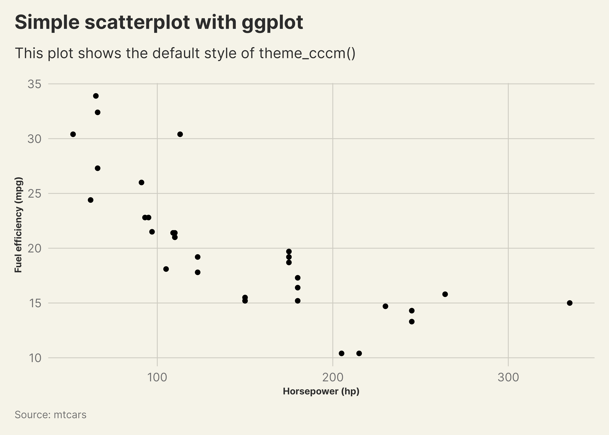

<!-- README.md is generated from README.Rmd. Please edit that file -->

# cccmthemes

<!-- badges: start -->

[](https://www.repostatus.org/#wip)
[](https://github.com/unhcr-dataviz/cccmthemes/actions/workflows/R-CMD-check.yaml)
[](https://CRAN.R-project.org/package=cccmthemes)
<!-- badges: end -->

Simplify the creation of your data visualizations with the
`{cccmthemes}` R package. It is designed to align your plots with
[CCCM’s Design Guide](https://www.cccmcluster.org/branding-collection)
recommendations. This package offers a comprehensive `{ggplot2}` theme,
including built-in customizations and thoughtfully crafted color
palettes.

## Installation

Get started by installing the `{cccmthemes}` package from GitHub using
the `{pak}` library:

``` r
# If pak is not yet installed, uncomment the following line:
# install.packages("pak")

pak::pkg_install("unhcr-dataviz/cccmthemes")
```

## Usage

``` r
# Load required packages
library(ggplot2)
library(cccmthemes)
```

### Base `{ggplot2}` theme

``` r
# Apply the theme_unhcr() to your plot
ggplot(
  mtcars,
  aes(x = hp, y = mpg)
) +
  geom_point() +
  labs(
    title = "Simple scatterplot with ggplot",
    subtitle = "This plot shows the default style of theme_cccm()",
    x = "Horsepower (hp)",
    y = "Fuel efficiency (mpg)",
    caption = "Source: mtcars"
  ) +
  theme_cccm()
```



### Font

The officially recommended font is
[`Inter`](https://github.com/rsms/inter). To ensure optimal
functionality of the `{cccmthemes}` package, please make sure that the
`Inter` font is installed on your device prior to usage.

## Acknowledgements

We extend our gratitude to the creators of the
[`{hrbrthemes}`](https://github.com/hrbrmstr/hrbrthemes),
[`{cowplot}`](https://github.com/wilkelab/cowplot/) and
[`{unhcrthemes}`](https://github.com/unhcr-dataviz/unhcrthemes) packages
that influenced the development of `{cccmthemes}`.

## Contribution

Contributions to `{cccmthemes}` are highly valued. If you have
suggestions, uncover bugs, or envision new features, kindly submit an
[issue on GitHub](https://github.com/unhcr-dataviz/cccmthemes/issues).
To contribute code, don’t hesitate to fork the repository and create a
pull request.

## License

This package is distributed under the [MIT
License](https://github.com/unhcr-dataviz/cccmthemes/blob/master/LICENSE.md).
